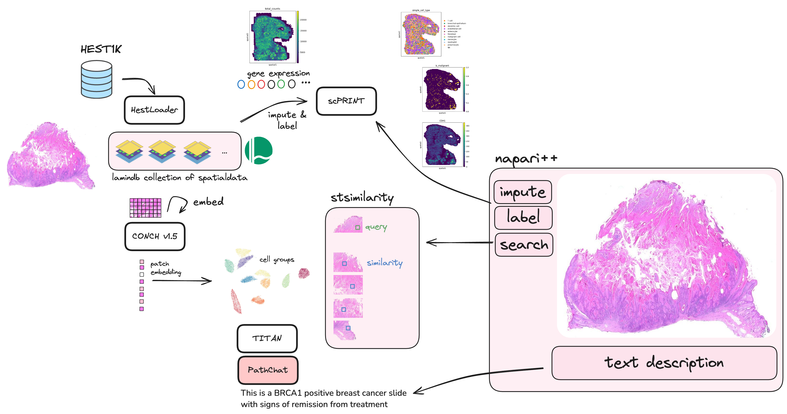

# Bio AI Hackathon 2024



Functionality:

- Getting embeddings using CONCH 1.5 for patches and TITAN for slides
- Scripts to run [scPRINT](https://github.com/mahmoodlab/HEST) on spatial xenium datasets to get cell types and full gene expression
- Downloader / converter of HEST1K to spatial data files in Lamindb
- DataLoader for spatialdata
- Extract embeddings from TITAN and store in .obsm() and ask questions
- Buttons and Textboxs to Napari to ask questions and search for patches

### 1. Install the package in editable mode

```bash
git clone git@github.com:jkobject/hackathon_bio_ai.git
cd hackathon_bio_ai
conda create -n st_challenge_dev python=3.10
conda activate st_challenge_dev
pip install -e .
```

### Install the package

```bash
conda create -n st_challenge_prod python=3.10
conda activate st_challenge_prod
pip install git+https://github.com/jkobject/hackathon_bio_ai.git
```


### 4. View an image
```bash
conda activate theremia
python -m st_challenge.scripts.viz_slice INT1
```
